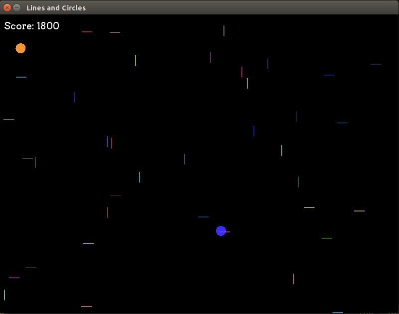

Lines and Circles (Love2D)
==========================

Nab the blue circles and don't get hit by the lines. Have fun!

Running Lines and Circles
-------------------------

You must have [Love2D](love2d.org) installed to run this. On
Debian-based Linux distros you can install it with this command:

~~~
$ sudo apt-get install love
~~~

You can install it on Windows by downloading and running the installer.

 * [32-bit installer](https://bitbucket.org/rude/love/downloads/love-0.9.1-win32.exe)
 * [64-bit](https://bitbucket.org/rude/love/downloads/love-0.9.1-win64.exe)

To run Lines and Circles, just double-click on `lines-and-circles.love`
